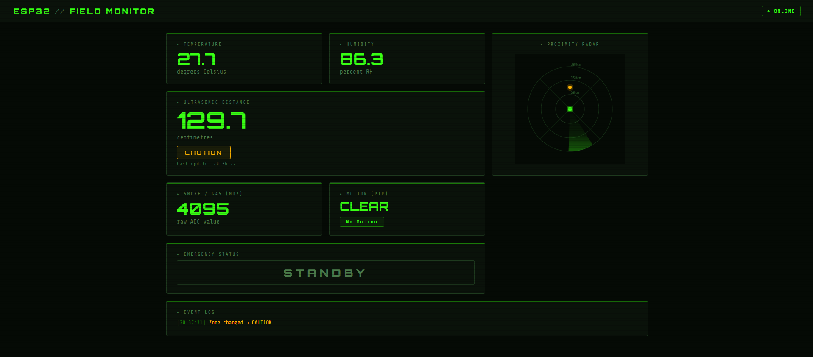
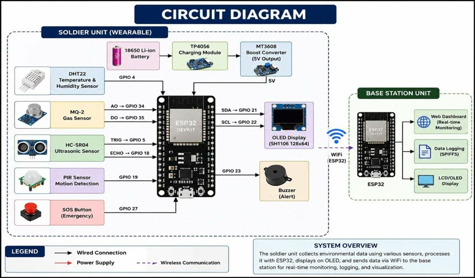
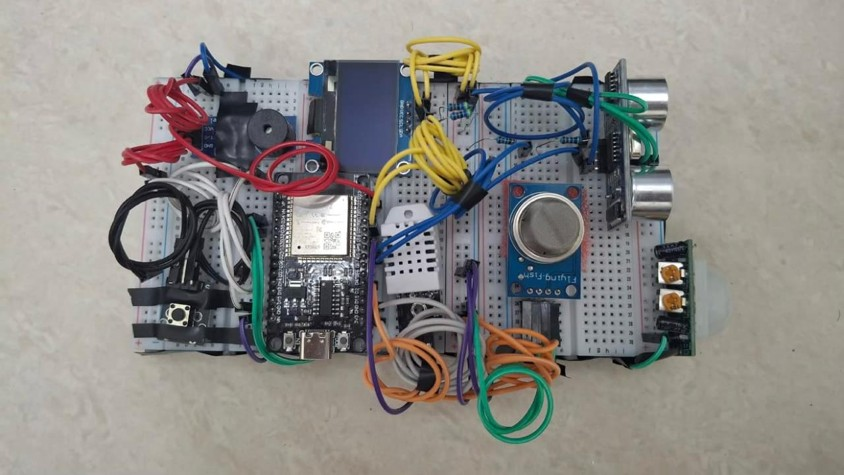

# 🪖 Soldier Safety & Monitoring System

An **ESP32-based IoT prototype** designed to monitor a soldier's surrounding environment in real time using multiple sensors and provide alerts through a web-based dashboard.

The system combines **embedded hardware, sensors, Wi-Fi communication, a Node.js backend, and a real-time web dashboard** into a single monitoring platform.

---

## ✨ Features

* 🌡️ Real-time temperature and humidity monitoring
* 💨 Smoke and gas detection
* 📏 Distance/proximity detection
* 🚶 Motion detection
* 🆘 Manual SOS/emergency button
* 🔊 Buzzer-based emergency alert
* 📺 OLED display for local status
* 📡 Wi-Fi communication using ESP32
* 💻 Node.js backend server
* 📊 Real-time web dashboard
* 📡 Radar-style proximity visualization
* 📝 Event/status monitoring

---

## 🧩 System Architecture

```text
                ┌─────────────────────┐
                │       SENSORS       │
                │                     │
                │  DHT22              │
                │  MQ-2               │
                │  HC-SR04            │
                │  PIR                │
                │  SOS Button         │
                └──────────┬──────────┘
                           │
                           ▼
                ┌─────────────────────┐
                │        ESP32        │
                │                     │
                │ Sensor Processing   │
                │ Emergency Detection │
                │ OLED Display        │
                │ Buzzer Control      │
                │ Wi-Fi Communication │
                └──────────┬──────────┘
                           │
                     HTTP / Wi-Fi
                           │
                           ▼
                ┌─────────────────────┐
                │    Node.js Server   │
                │                     │
                │ API Endpoint        │
                │ Data Processing     │
                │ Dashboard Server    │
                └──────────┬──────────┘
                           │
                           ▼
                ┌─────────────────────┐
                │   Web Dashboard     │
                │                     │
                │ Temperature         │
                │ Humidity            │
                │ Gas/Smoke           │
                │ Distance            │
                │ Motion              │
                │ Emergency Status    │
                │ Event Information   │
                └─────────────────────┘
```

---

## 🔧 Hardware Components

| Component                     | Purpose                                      |
| ----------------------------- | -------------------------------------------- |
| **ESP32 DevKit**              | Main microcontroller and Wi-Fi communication |
| **DHT22**                     | Temperature & humidity measurement           |
| **MQ-2**                      | Smoke/gas detection                          |
| **HC-SR04**                   | Distance/proximity measurement               |
| **PIR Sensor**                | Motion detection                             |
| **SH1106 OLED**               | Local display                                |
| **Push Button**               | Manual SOS trigger                           |
| **Buzzer**                    | Local emergency alert                        |
| **Breadboard & Jumper Wires** | Circuit connections                          |
| **Laptop**                    | Node.js server and monitoring dashboard      |

---

## 🔌 Pin Configuration

| Component    | ESP32 GPIO |
| ------------ | ---------: |
| DHT22 Data   |     GPIO 4 |
| MQ-2 Analog  |    GPIO 34 |
| MQ-2 Digital |    GPIO 35 |
| HC-SR04 TRIG |     GPIO 5 |
| HC-SR04 ECHO |    GPIO 18 |
| PIR OUT      |    GPIO 19 |
| SOS Button   |    GPIO 27 |
| Buzzer       |    GPIO 23 |
| OLED SDA     |    GPIO 21 |
| OLED SCL     |    GPIO 22 |

> ⚠️ **Hardware note:** Make sure the voltage levels supplied to the ESP32 GPIO pins are within ESP32 specifications. In particular, verify the HC-SR04 ECHO signal level before connecting it directly to an ESP32 GPIO.

---

## 📁 Project Structure

```text
Idea-lab/
│
├── arduino/
│   └── arduino.ino
│
├── esp32-dashboard/
│   ├── index.html
│   ├── server.js
│   ├── package.json
│   └── package-lock.json
│
├── CIRCUIT_DIAGRAM.jpg
├── Dashboard.png
├── FINAL_PROTOTYPE.jpg
├── Final_IDEALAB_Report_Soldier_Safety_ESP32.docx
├── instruction.md
├── run.md
└── README.md
```

### `arduino/`

Contains the ESP32 firmware responsible for:

* Reading sensor data
* Detecting emergency conditions
* Updating the OLED
* Controlling the buzzer
* Connecting to Wi-Fi
* Sending data to the Node.js server

### `esp32-dashboard/`

Contains the web dashboard and Node.js backend responsible for:

* Receiving ESP32 data
* Serving the dashboard
* Displaying live sensor readings
* Showing emergency status
* Displaying proximity information
* Handling communication with the ESP32

---

## 💻 Software Requirements

* [Arduino IDE](https://www.arduino.cc/en/software)
* ESP32 board package for Arduino IDE
* Node.js
* npm
* A modern web browser

### Arduino Libraries

Install the required libraries through the Arduino IDE Library Manager:

* `DHT sensor library`
* `Adafruit Unified Sensor`
* `U8g2`

---

## ⚙️ Setup

### 1. Clone the Repository

```bash
git clone https://github.com/samarthprabhu2007-art/Idea-lab.git
cd Idea-lab
```

### 2. Install Dashboard Dependencies

```bash
cd esp32-dashboard
npm install
```

### 3. Start the Dashboard Server

```bash
npm start
```

The dashboard can then be accessed from your browser at:

```text
http://localhost:3000
```

---

## 📡 ESP32 Configuration

Open:

```text
arduino/arduino.ino
```

Before uploading the code, configure your Wi-Fi and server settings.

**Do not commit real Wi-Fi credentials to GitHub.**

Use placeholders such as:

```cpp
const char* WIFI_SSID = "YOUR_WIFI_NAME";
const char* WIFI_PASS = "YOUR_WIFI_PASSWORD";
```

Configure the Node.js server address according to your local network:

```text
http://YOUR_LAPTOP_IP:3000
```

The **ESP32 and laptop must be connected to the same Wi-Fi network** for the local setup.

---

## ▶️ Running the Project

Follow these steps:

### Step 1 — Connect the Hardware

Connect the sensors and peripherals to the ESP32 according to the pin configuration above.

### Step 2 — Start the Backend

From the dashboard directory:

```bash
npm install
npm start
```

### Step 3 — Upload ESP32 Firmware

Open `arduino/arduino.ino` in Arduino IDE and upload it to the ESP32.

### Step 4 — Open the Dashboard

Open:

```text
http://localhost:3000
```

### Step 5 — Test the Sensors

Test each component individually:

* Move an object toward the HC-SR04
* Trigger the PIR sensor
* Check temperature/humidity readings
* Test smoke/gas detection
* Press the SOS button
* Verify the buzzer
* Confirm the dashboard updates

---

## 📊 Dashboard

The dashboard provides a centralized view of the data received from the ESP32.

It displays:

* Temperature
* Humidity
* Gas/smoke readings
* Distance
* Motion status
* Emergency status
* Proximity visualization
* Device/system information

### Dashboard Preview



---

## 🖼️ Project

### Circuit Diagram



### Final Prototype



---

## 🧪 Example Workflow

A typical data flow looks like this:

```text
Sensor detects event
        ↓
ESP32 reads sensor
        ↓
ESP32 processes the reading
        ↓
ESP32 sends data over Wi-Fi
        ↓
Node.js server receives data
        ↓
Dashboard updates
        ↓
User observes status / alert
```

For an emergency condition:

```text
Emergency detected
        ↓
ESP32 activates local alert
        ↓
Sensor data sent to server
        ↓
Dashboard reflects emergency state
```

---

## 🔐 Security Considerations

This project is an **educational prototype** and is intended to operate on a controlled local network.

For a real-world deployment, additional security measures would be required, including:

* Secure credential management
* HTTPS/TLS communication
* Authentication between ESP32 and server
* Input validation
* Secure API endpoints
* Encrypted data transmission
* Proper device authentication
* Reliable emergency/fail-safe mechanisms

**Never commit real Wi-Fi passwords, API keys, tokens, or other secrets to the repository.**

---

## 🚀 Future Improvements

The prototype can be extended with:

* 📍 GPS-based soldier location tracking
* 📱 Mobile application
* ☁️ Cloud-based monitoring
* 🔐 Encrypted communication
* 🔋 Battery-level monitoring
* 📈 Historical sensor data and graphs
* 🚨 Remote emergency notifications
* 📡 Long-range communication using LoRa
* 👥 Multiple-device/soldier monitoring
* 🧠 Intelligent anomaly detection
* 📴 Offline data buffering when Wi-Fi is unavailable

---

## 🎯 Project Objective

The objective of this project is to demonstrate how **IoT, embedded systems, sensors, wireless communication, and web technologies** can be integrated to create a real-time monitoring and alert system.

The prototype provides a foundation that can be further developed into a more robust remote safety and monitoring platform.

---

## 📚 Documentation

Additional project documentation is available in the repository:

* `instruction.md` — Setup and implementation information
* `run.md` — Running instructions
* `Final_IDEALAB_Report_Soldier_Safety_ESP32.docx` — Detailed project report

---


---

## 📜 License

This project is intended for **educational and academic purposes**.
